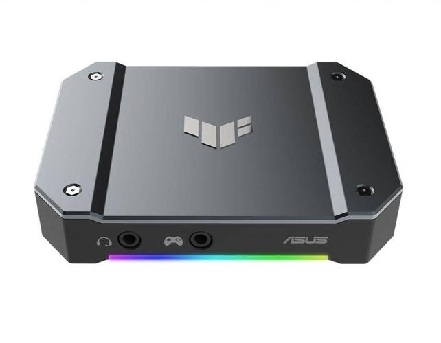
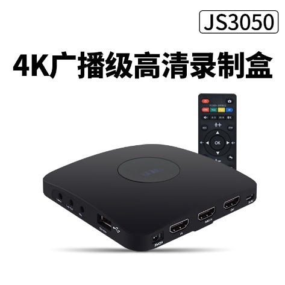
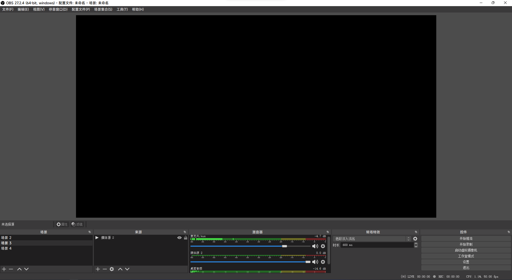

# 直播入门

## 认识设备

### 摄像机 （JVC JY-HM95）

摄像机相比每位DV社成员都十分熟悉，有关摄像机具体的教学，这里不过多赘述，这里只讨论和导播有关的知识。

摄像机若想输出画面，最核心的部件自然是它的音视频输出接口。本社使用HDMI输出接口输出音频与视频。HDMI接口一般位于摄像机的机身左右侧或后部。如本社团的JVC JY-HM95 摄像机，其HDMI接口位于机身右侧。（如下图所示）

如上文所述，摄像机存在音视频输出接口，自然也需要插入对应的数据线，如HDMI接口插入HDMI线。需要强调的是，有时候接口并非是固定一个模样的。以本社团的设备为例， JVC JY-HM 95摄像机（大机）配备的是标准HDMI接口。

### 索尼AX60 DV机

至于索尼AX60 DV机（小机），它配备的则是micro HDMI接口。

这与标准HDMI接口的大小不同，但都支持HDMI协议，说明我们可以使用相同类型的数据线进行连接操作。但不同之处在于，**micro HDMI接口需要外接一个接口转换器，才能使用标准HDMI数据线。** 接口转换器将在下文进行讲解。**另外，根据以往的直播经验，受限于DV机的电池容量，我们需要为DV机外接一根电源线,以确保其正常工作。**

**通常在DV机电量显示1/3左右时，为其连接电源线。注意USB应该与充电宝的5V 2A输出相连接，确保供电足够。**

### HDMI转换头

#### 标准HDMI转HDMI

像这样的转换头，一般用于稳固连接使用。**如果在导播时遇到了摄像机无画面输出的情况，很可能是数据线和摄像机之间接触不良导致的。** 不妨在HDMI数据线连接处插上一个转换头试试。在2021年魔方公开赛直播时，我们借用了一位老师的DV机，插上HDMI数据线之后无画面输出。使用了该转接头后，问题得以解决。

#### Micro HDMI / Mini HDMI转标准HDMI转换头

如上文所述，索尼AX60 DV机使用Micro HDMI接口输出音视频，这时就需要一个转换头把接口转换成标准HDMI接口，便于后续HDMI数据线的连接。另一种Mini HDMI接口则在单反相机上较为常见。

#### Micro HDMI 转标准HDMI转换头

同样用于转换HDMI接口,一般用于小机的连接.究竟是使用上文的转换头，还是本段提到的转换头，视实际情况而定.【例如(Micro HDMI / Mini HDMI转标准HDMI转换头)会阻碍其它数据线连接等等情况】。

### 切换台（导播台）

切换台又称导播台，是选择音视频输入信号并进行简单图像处理的设备。一般来说，晚会现场需要直播，我们有两台摄像机分别录制两个画面——人物特写和舞台全景。但是我们最终呈现给观众的只能有一个画面，这个时候就需要切换台了。导播技术中有一个概念叫“路”，也就是一个信号源的意思。如所谓“双路切换台”，即可以输入并切换两路信号源的切换台。本社团的切换台即是如此。

**各个端口对应如下:**

| 接地线螺丝 | 电源输入 | USB升级端口 | 踏板控制连接端口 | 节目输出 | 预览输出 | 输入2 | 输入1 |
| --- | --- | --- | --- | --- | --- | --- | --- |
| 不使用 | 与电源适配器连接 | 不使用 | 不使用 | 连接视频采集盒 | 连接监视屏 | 连接大机 | 连接小机 |

此处以本社团的罗兰V-02 HD切换台为例。该切换台提供两路HDMI信号输入（INPUT1和INPUT2），一个节目输出接口（PROGRAM OUT），一个预览输出接口（PREVIEW OUT）。节目输出接口是给观众看的其中一路摄像机的画面，而预览输出接口则是另一路摄像机的画面。我们要做的便是适时切换两部摄像机的画面，让观众能够从不同角度观看演出。有关切换台的详细说明，另请参阅说明书。实际使用将在后文介绍。

### 监视屏

与切换台的预览输出接口（PREVIEW OUT）连接，监视其中另一路摄像机的画面情况，作为参考，并适时切换节目输出（PROGRAM OUT）画面。**注意：监视屏开机后,首先把监视屏的音量设置调至静音，然后再连接HDMI数据线。否则会导致监视屏因供电不足导致的反复重启。**

### 视频采集盒

视频采集盒是采集HDMI信号，并把HDMI信号输出至电脑的设备。本社团有三台视频采集盒。它们的功能不完全一样。下面进行简单介绍。

#### 华硕TUF Gaming Capture Box-CU4K30

华硕视频采集盒是本社2022年新采购的设备之一。它最高支持4k 30帧的超清画质输出。不支持直接录制。
**请注意:
1.受限于目前工作站性能,在OBS Studio中需要限制输入画质为1080p 30fps;
2.采集盒的USB-TypeC数据线与普通手机充电线不通用,若遗失或者损坏,请自行购买兼容USB3.2协议的USB-TypeC数据线。**

#### 九音九视JS3010/JS3050采集/录制盒

本社另有两个九音九视公司生产的录制盒，基本原理大致相同。与上文华硕视频采集盒不同之处在于，它们最高仅支持1080p 30fps的画质输出。这两款采集盒都具有录制功能，可以连接U盘录制HDMI输入的画面与音频，并储存为视频文件格式，方便后期剪辑回放等操作。

### 电脑

#### 戴尔Precision 7510 移动工作站

本社配备了性能强劲的戴尔Precision 7510移动工作站。日常社团活动中，担任视频剪辑任务；在各类大型活动中，担任视频直播任务。稍后将会介绍直播时电脑上相关软件的操作步骤。

#### 联想昭阳G50-45笔记本电脑

除了移动工作站外，本社还有一部联想昭阳G50-45笔记本电脑。由于性能羸弱，直播中仅负责输出礼堂混音至移动工作站的任务。实际使用将在后文介绍。

#### 迅捷FW300UH USB3.0无线网卡

本社配备了迅捷的USB无线网卡。直播时将网卡与移动工作站连接，可以有效提高网络稳定程度，提升直播时画面的流畅度。**请注意,移动工作站的USB接口较为松动,直播时尽量避免碰到USB线!**

#### 小米对讲机 Lite

对讲机便于晚会直播时,导播台人员与摄像机机位人员沟通协调。

### 人员分工

#### 人数

一般来说，校园导播工作不建议个人单独完成，除在极个别紧急情况下可由技术能力顶尖的同学单独完成。在礼堂进行的活动，一般情况下应安排不少于4人，不多于6人参加工作；在礼堂外进行的活动，除个别规模宏大的活动（如校庆晚宴）外，一般应安排不少于2人，不多于5人参加工作。另外，未充分掌握技术跟岗学习的同学不应计入实际工作总人数，且跟岗学习的同学不建议超过实际工作总人数的50%。

#### 职务分工

一般来说，校园导播工作要有以下几种职务分工：总指挥、导播师、摄像师。总指挥应负责现场工作的领导并协调各类工作；导播师应负责导播工作、硬件现场维护和线路布置；摄像师应负责操作摄像机并协助布置线路。

### 软件认识

#### ~~HDML-Cloner Pro Helper~~

~~这是九音九视JS3010/JS3050采集/录制盒的配套软件。图标如上图所示。在直播或校运会终点记录工作时使用。若移动工作站未运行该软件，将无法进行HDMI视频采集工作。(已弃用)~~

#### OBS（Open Broadcaster Software）

这是一个常见的直播软件。图标如上图所示。我们使用该软件进行视频直播工作。软件界面如下图所示。

## 操作开始
